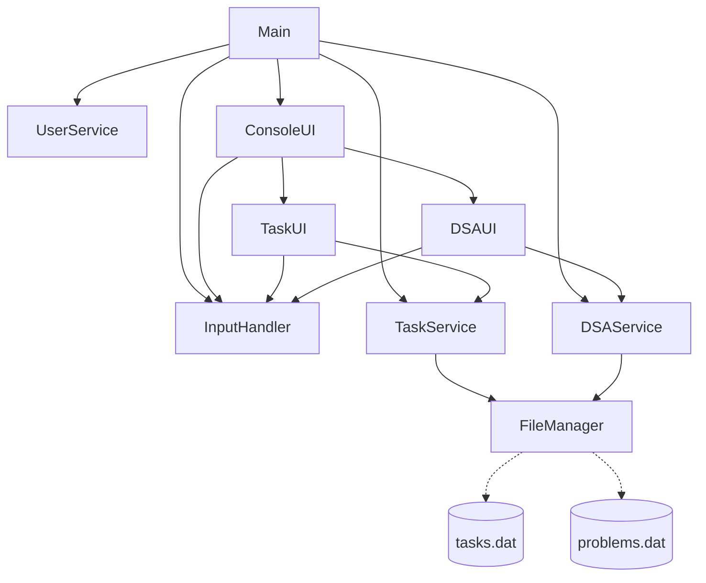

# Project Aegis: Architectural Guide

This document describes the design philosophy, architectural boundaries, code conventions, and technical specifications of **Project Aegis**. It is intended to guide both human developers and AI coding assistants.

---

## 1. Design Philosophy

Project Aegis exists primarily as a software engineering learning project. The design is governed by the following core principles:

* **Learn by building**: Focus on understanding concepts by implementing them from scratch rather than relying on heavy abstractions or third-party frameworks.
* **Prefer simple solutions**: Code should be readable and straightforward. Avoid "clever" logic or over-engineering.
* **Incremental refactoring**: Refactor only when duplication or maintenance issues become obvious in code structure.
* **Avoid unnecessary patterns**: Do not apply design patterns unless they solve a concrete, existing problem.
* **Strict separation of concerns**:
  * **Services** own business logic, state processing, and query operations.
  * **UIs** own interactive loops, input parsing, validation, and console output.
  * **Models** only store data structures (Plain Old Java Objects).
  * **Storage** only handles read/write serialization logic.
* **Incremental development**: Implement features step-by-step, ensuring clean builds and complete commits at each stage.

---

## 2. Java Knowledge Baseline

To ensure suggestions match the developer's learning path, here is the current baseline of Java knowledge:

| Status | Concepts |
| :--- | :--- |
| **Completed** | OOP, Collections Framework, Exception Handling, Object Serialization, File Handling, Enums |
| **Learning** | Generics, `Comparator`, `Comparable`, Functional Interfaces |
| **Not Yet Learned** | Java Streams API, Multithreading, Reflection API, Spring Framework |

---

## 3. Coding Style & Rules

All new code added to Project Aegis must adhere to these style guidelines:

* **Constructor Injection**: Inject dependencies (e.g., Services, InputHandlers) through class constructors. Avoid manual initialization inside the dependent class.
* **No Static Business Logic**: Maintain instance-based methods in services to keep code modular and testable.
* **No Global Variables**: Pass references via injection or method arguments.
* **Prefer Composition**: Build complex functionalities by composing simple objects rather than creating deep inheritance hierarchies.
* **Avoid Inheritance**: Only use inheritance when there is a clear, justified "is-a" relationship (e.g., standard custom models if necessary).
* **Service Independence**: Services should be isolated from each other. They must not have circular dependencies.
* **Manual Dependency Injection**: All objects are initialized and wired together manually in `Main.java`. Do not use Spring/Guice or other DI containers.

---

## 4. Architecture Rules & Boundaries

Data and execution flow strictly downwards through the layers:

$$\text{ConsoleUI} \longrightarrow \text{Feature UI (e.g., TaskUI, DSAUI)} \longrightarrow \text{Service Layer} \longrightarrow \text{Storage Layer}$$

* **Models never call services**: Model classes must remain pure data holders without behavioral dependencies.
* **Services never print**: Services must never use `System.out.println()` or request inputs. All interface interactions belong in the UI layer.
* **Storage never validates**: The persistence layer only reads and writes bytes to disk; it assumes incoming data is already validated.
* **UI never edits model fields directly**: All data mutations must go through the appropriate service method (e.g., `taskService.editTitle(...)`), which coordinates validation and triggers saves.

---

## 5. Current Package & Class Structure

The active system layout contains the following directories and files:

```
src/
 ├── app/
 │    └── Main.java             # Entry point; wires and starts UI
 ├── enums/
 │    ├── Category.java         # Task category types
 │    ├── Difficulty.java       # DSA problem difficulty types
 │    ├── Priority.java         # Task priority levels
 │    └── Topics.java           # DSA topic tags
 ├── model/
 │    ├── Problem.java          # DSA Problem data model
 │    ├── Task.java             # Task data model
 │    └── User.java             # User Profile data model
 ├── service/
 │    ├── DSAService.java       # DSA business logic and search algorithms
 │    ├── TaskService.java      # Task business logic and sorting algorithms
 │    └── UserService.java      # User Profile initialization logic
 ├── storage/
 │    └── FileManager.java      # Serializes task and problem lists to disk
 └── ui/
      ├── ConsoleUI.java        # CLI Main Router
      ├── DSAUI.java            # CLI Sub-Router for DSA Tracker
      ├── InputHandler.java     # Console reader & parser
      ├── MenuRenderer.java     # Console menu renderer
      └── TaskUI.java           # CLI Sub-Router for Task Manager
```

---

## 6. Dependency Graph

The execution dependencies between major classes are structured as follows:



---

## 7. Class Summary

* **`Main`**: Starts the application, instantiates all service and UI classes, injects them, and invokes `ConsoleUI.start()`.
* **`Category` / `Difficulty` / `Priority` / `Topics`**: Domain enumerations ensuring type-safe choices for attributes like task priorities and DSA topics.
* **`Problem`**: Stores detail metadata for solved algorithm problems. Encapsulates status flags like `favorite` and `needsRevision`.
* **`Task`**: Stores task attributes, handles completions, and formats strings for display.
* **`User`**: Data container for profile configuration.
* **`DSAService`**: Holds the active list of algorithm problems. Processes edits, counts problems by difficulty, queries problems by difficulty or topic, and triggers saving to disk.
* **`TaskService`**: Holds the active list of tasks. Processes edits, checks index boundaries defensively, sorts tasks by deadline using lambda comparators, and triggers saving.
* **`UserService`**: Simple bootstrap logic to prepare the active user context.
* **`FileManager`**: Reads and writes files (`tasks.dat`, `problems.dat`) using Java `ObjectOutputStream` / `ObjectInputStream`.
* **`ConsoleUI`**: Coordinates main menu selection and forwards execution to module-specific UIs.
* **`DSAUI`**: Captures CLI inputs for problem entry, calls `DSAService` for modifications, and formats problem logs for screen rendering.
* **`TaskUI`**: Captures CLI inputs for task modifications, calls `TaskService` to apply updates, and displays list tables.
* **`InputHandler`**: Standardizes all keyboard reads. Wraps `Scanner` calls with exceptions catching and data conversions (e.g. string to `LocalDate`).
* **`MenuRenderer`**: Contains static string templates of CLI layouts.

---

## 8. Current Design Quality

### Separation of Concerns & SRP (Single Responsibility Principle)
* **Status**: Highly maintained.
* **Detail**: Views (UIs) only handle presentation, services handle application data, models structure the state, and `FileManager` handles file logic.

### Coupling & Cohesion
* **Status**: High Cohesion / Low Coupling.
* **Detail**: Classes are highly cohesive; all methods relate directly to the component's primary purpose. Coupling is kept low by passing primitive parameters or model references rather than internal implementation details.

### Encapsulation
* **Status**: High.
* **Detail**: Fields are private. Collections are protected from external edits by returning read-only copies (`List.copyOf()`) inside getters.

### Reusability
* **Status**: Medium.
* **Detail**: `InputHandler` and `FileManager` can be reused easily in any Java CLI application. 

### Scalability
* **Status**: Low.
* **Detail**: Using binary file serialization is not scalable for multiple clients, and manual wiring in `Main` gets heavy as the codebase grows. This is a known, accepted limitation for a learning project.

---

## 9. Technical Debt

* **Brittle Persistence**: Java Serialization breaks if package names or fields inside `Task` or `Problem` are modified.
* **Dead Code / Empty Placeholders**: Empty directories and files (`exception`, `repository`, `utils`) exist. While they serve as directory structure placeholders, they cause clutter.
* **No Unit Tests**: There are no tests to verify changes to business logic do not break existing behaviors.
