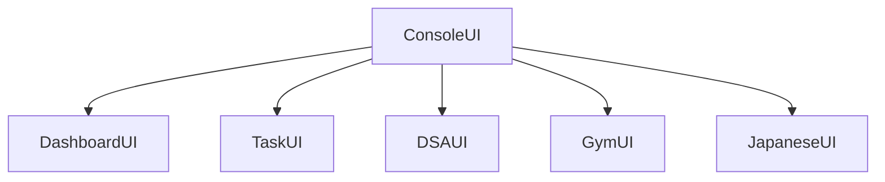

# Project Aegis: Development Roadmap

This document outlines the version milestones, project status, future architecture targets, and prospective features of **Project Aegis**.

---

## 1. Version History

This log tracks key milestones and feature implementations:

* **`v0.1`**: Core User Profile structure.
* **`v0.2`**: Task Manager CRUD functionality (without persistence).
* **`v0.3`**: Persistent storage using native Java Serialization (`tasks.dat`).
* **`v0.4`**: DSA Tracker module with CRUD operations, search filters, and persistence (`problems.dat`).
* **`v0.4.5` (Current)**: UI Layer refactoring. Separated unified UI controllers into `DSAUI` and `TaskUI` sub-routers, standardized `InputHandler` parsers, and implemented bounds validation.

---

## 2. Project Status & Roadmap

The implementation roadmap is divided into clear phases:

```
[Completed]
 ✓ User Profile
 ✓ Task Manager
 ✓ File Persistence
 ✓ DSA Tracker
 ✓ UI Controller Refactoring

[Current Phase]
 ➔ Japanese Language Tracker (v0.5.0)

[Next Phase]
 ❑ Gym Workout Tracker

[Future Goals]
 ❑ Aggregate Dashboard
 ❑ Productivity Analytics
 ❑ CSV/JSON Exporting
 ❑ Database Migration (SQLite/JSON)
```

---

## 3. Future Architecture Target

As modules are built, they will hook into `ConsoleUI` via router delegation. The planned layout of the CLI system is structured below:



* The user logs in and lands on the main dashboard (`DashboardUI`).
* From the dashboard, they can drill down into individual feature sub-menus (`TaskUI`, `DSAUI`, `GymUI`, `JapaneseUI`).

---

## 4. Upcoming Modules & Extension Strategy

Adding new features is designed to be straightforward thanks to the modular layered architecture:

### A. Japanese Language Tracker (v0.5.0)
* **Goal**: Track vocabulary, kanji progress, grammar notes, and lessons.
* **Preparation**: Model (`JapaneseProgress.java`) and service (`JapaneseService.java`) placeholders are already defined in the packages.
* **Next Steps**:
  1. Add progress tracker fields to `JapaneseProgress.java`.
  2. Implement business logic (add vocabulary, log lesson completion) in `JapaneseService.java`.
  3. Create `JapaneseUI.java` to handle CLI menus and user interactions.
  4. Inject `JapaneseService` and `JapaneseUI` inside `Main.java` and expose the option in `ConsoleUI.java`.

### B. Gym Workout Tracker
* **Goal**: Log exercises, workout routines, sets, reps, weight metrics, and personal records.
* **Preparation**: Model (`Workout.java`) and service (`GymService.java`) placeholders exist.
* **Next Steps**: Follow the same layered pattern as other modules (Model $\to$ Service $\to$ UI $\to$ Wire in Main).

### C. Analytics Dashboard
* **Goal**: Provide unified progress summaries (e.g. daily tasks completion rates, number of DSA questions resolved, workout frequency).
* **Preparation**: `DashboardService.java` is created as a placeholder.
* **Next Steps**:
  1. Inject `TaskService`, `DSAService`, and future trackers into `DashboardService`.
  2. Implement summary methods to compute performance statistics.
  3. Create a `DashboardUI` interface to render charts, status reports, and progress bars.

### D. Exporting Utility
* **Goal**: Export logged data to standard files (CSV/JSON).
* **Next Steps**: Create a helper class in `utils` (e.g., `DataExporter.java`) that reads collections from services and formats them as standard comma-separated text blocks or JSON strings.

### E. Database Migration
* **Goal**: Replace Java binary serialization (`.dat` files) with standard relational databases (SQLite / H2) or standard JSON structure to improve data security and schema stability.
* **Next Steps**:
  1. Re-implement the repository pattern utilizing JDBC connectors.
  2. Swap out `FileManager` with database handlers.
  3. Write migration scripts to convert existing binary data to the new DB format.
